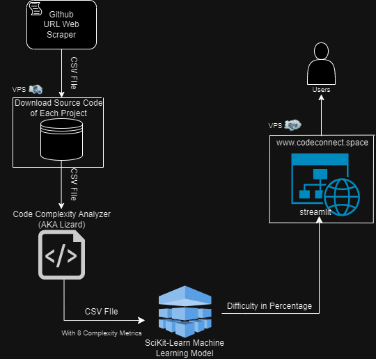

# TheMLGs
# CodeConnects - NASA SPACE APPS LLD

## Overview

CodeConnects is a revolutionary machine learning web application designed to enhance accessibility and collaboration among programmers. It connects users with open-source projects by calculating the difficulty level of a project based on its codebase complexity. This project aims to facilitate collaboration by matching users with the best-fit open-source projects according to their search criteria. The difficulty prediction score ranges from 0% (least challenging) to 100% (most challenging). This low-level document provides insights into the project's infrastructure setup, data sources, tools used, machine learning training, and user content display.

## Infrastructure Setup Design

### Goals

- Fetch upstream data from Github.com and extract necessary elements from most popular and trending open-source repositories, with a minimum of 50 projects stored in a CSV file.
- Download each repository’s full source code on a private server from a URL, then use Lizard to analyze code complexity heuristics and compute five metrics. Then make a script to add these results to the CSVs columns which are sent back to the server.
- Train the machine learning model with scikit-learn to predict difficulty level using Lizard’s computations.
- Create a user-friendly web application that allows users to discover the perfect project for collaboration by inputting various search parameters and returning predicted difficulty scores.

## Github Web Scraper

The first step required to train our machine learning model is to create a clean dataset for it to understand and learn from. To accomplish this, we built a Web Scraper using the Python library Beautiful Soup. In the web scraper, we have a list of URLS and a loop that goes through each one to get the necessary elements and displays them in CSV format using the Pandas library. Our team decided to extract the following parameters: user name, project name, repository URL, about, license, stars, and languages used for each project. These parameters are then presented in columns, while the projects are presented in rows.

**(GithubScraper.py code snippet, Javier Cunat)**

## Script to Download Each Source Code

Talk about downloading to the server, specify server size, and a few details.

## Code Complexity Analyzer and Script

Discuss multithreading velocity and scalability.

## Training SciKit Model

Discuss machine learning model training with scikit-learn.

## Web Application

Talk about the web application, its purpose, design using Flask, scalability, and limitations.

### Inputs

- Search Parameters
- Language
- Code Length
- # of contributors
- Activity of project owner
- Accessibility/Friendliness with project owner
- Project Activity

## Dataset

Discuss the dataset used for machine learning training.

## Project Plan

### High-Level Tasks

- Javier Cunat: Python Web Scraper, Train ML Model, LLD Technical Writing and Project Design, Domain name and Public VPS.
- Jose A. Martinez: Haskell Lizard Script, Server access and Private VPS.
- Alejandro Salaz: Web application, Python Parser, ML Script.
- Keelan Macahdo: Hackathon Film “The MLGs at NASA Space Apps” and Mathematical Computations.
- Michael Hidalgo & Kevin Parra: Figma Design for UI/UX, Presentation, Project submission.

## Future Objectives

- Implement more complex search parameters to give users a more dynamic experience and connect them to better-fit projects.
- Scraper continuously gets new open-source repositories for 100s of codebases.

## Source Code, User Experience/Interface Design, Film, & Presentation

- [GitHub Repository](https://github.com/Pachin0/TheMLGs)
- [Figma Design](https://www.figma.com/file/uQNpCqQyuPLEWHIfLoZqry/NASA-Space-Apps-Challenge?type=design&node-id=0-1&mode=design&t=csF7zPxyvUrSsh1X-0)

## Resources

- [GitHub](https://github.com)
- [OpenAI Chat](https://chat.openai.com)
- [CKEditor Blog](https://ckeditor.com/blog/is-coding-for-everyone/)
- [3DGlobes](https://www.3dglobes-wf.com/resources)
- [Linux Mascot History](https://www.google.com/url?sa=i&url=https%3A%2F%2Fwww.techrepublic.com%2Farticle%2Ftux-a-brief-history-of-the-linux-mascot%2F&psig=AOvVaw0JLFe9_jEyql7UsdQfxlwB&ust=1696857422930000&source=images&cd=vfe&opi=89978449&ved=0CBMQ3YkBahcKEwiAl463yuaBAxUAAAAAHQAAAAAQBA)
- [TensorFlow](https://github.com/tensorflow/tensorflow)
- [Linux Kernel](https://github.com/torvalds/linux)
- [JavaScript](https://www.w3schools.com/whatis/whatis_js.asp)
- [Visual Studio Code](https://github.com/microsoft/vscode)
- [Problem Solving in JavaScript](https://github.com/knaxus/problem-solving-javascript)
- [Visual Studio Code (Wikiversity)](https://en.wikiversity.org/wiki/Visual_Studio_Code)
- [NASA Space Apps Challenge](https://www.spaceappschallenge.org/)

## Tools

- [Figma Design](https://www.figma.com/files/recents-and-sharing?fuid=1292302123490584545)
- [scikit-learn](https://scikit-learn.org/stable/)
- [Lizard](https://github.com/terryyin/lizard)
- [Beautiful Soup](https://www.crummy.com/software/BeautifulSoup/)
